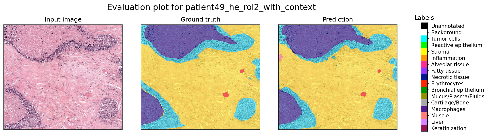
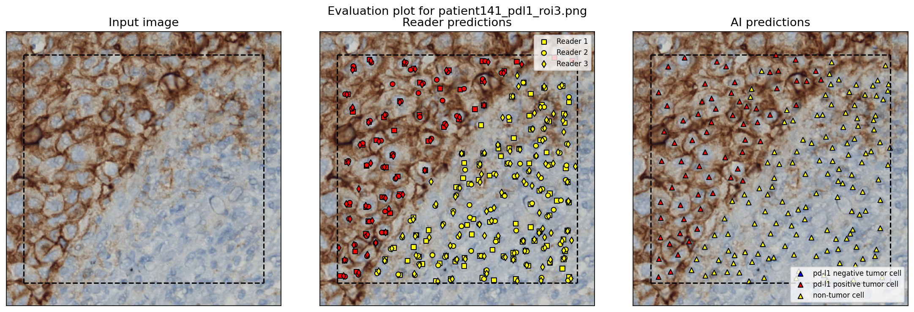
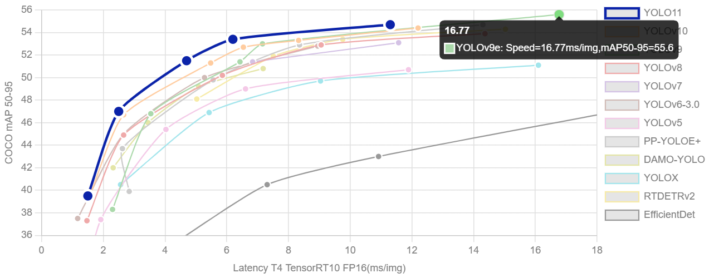

# IHC 세포 검출 알고리즘 구현

담당자: 영섭 이
진행 상태: 진행 중
프로젝트: 바이오마커 IHC 지표 계산 (https://www.notion.so/IHC-26142971c02f80b98f34fb6ee0ae865b?pvs=21)
우선순위: 높음
태그: AI) Cell Detection
git repositories: https://github.com/Leeyoungsup/ihc_cell_count

# Dataset

**IGNITE data toolkit**

- 폐암 H&E 패치 이미지의 조직 분할 라벨 포함
- 폐암 IHC PD-L1 패치 이미지의 셀 검출 라벨 포함
- 관련링크
- [https://github.com/DIAGNijmegen/ignite-data-toolkit](https://github.com/DIAGNijmegen/ignite-data-toolkit)
-[https://zenodo.org/records/15674785](https://zenodo.org/records/15674785)

# Model

- 검출 모델 YOLOv11 사용
- 커스텀을 위하여 모델구조와 loss 만 사용하여  전체 running 코드 구축
- 관련 링크
-[https://docs.ultralytics.com/ko/models/yolo11/](https://docs.ultralytics.com/ko/models/yolo11/)
-[https://github.com/Leeyoungsup/ihc_cell_count](https://github.com/Leeyoungsup/ihc_cell_count)

# Training

- 커스텀을 위하여 모델구조와 loss 만 사용하여  전체 running 코드 구축

